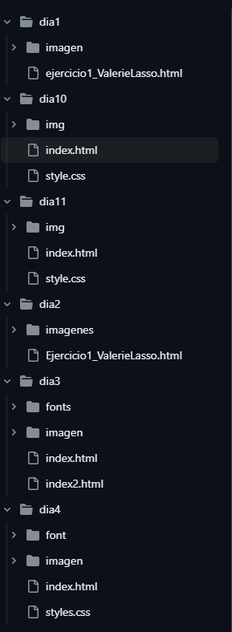
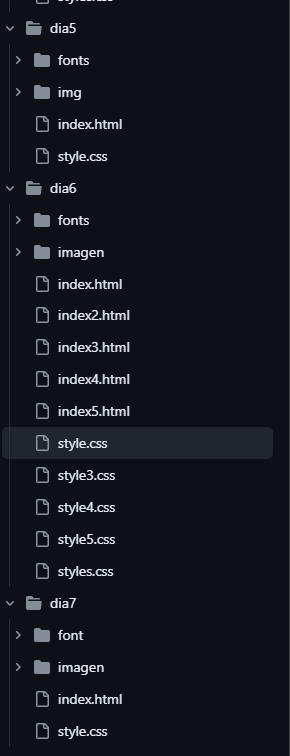
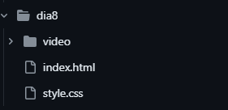

# HTML Y CSS
En este repositorio encontrarás 11 carpetas donde cada una contiene un trabajo de html y css desarrollados en casa a medida que se avanzaba el curso.

## División de Carpetas 

|Carpetas|Número de Trabajos|
|--|--|
|dia1| 1 trabajo|
|dia2| 1 trabajo|
|dia3| 1 trabajo|
|dia4| 1 trabajo|
|dia5| 1 trabajo|
|dia6| 1 trabajo|
|dia7| 1 trabajo|
|dia8| 1 trabajo|
|dia9| 1trabajo|
|dia10| 1 trabajo|
|dia11| 1 trabajo|

## Instalación 
1. Clona el repositorio: Utiliza el comando "git clone" seguido de la URL del repositorio para clonar el proyecto en tu computadora local.

2. Abre la carpeta del proyecto: Navega a la carpeta donde se clonó el proyecto y ábrela en tu editor de código favorito.

3. Abre el archivo HTML: Busca el archivo HTML principal (usualmente "index.html") y ábrelo con la extensión live server.

## Explicación 

En este repositorio hay variedad de páginas que están contenidas en las 11 carpetas. Cada carpeta cuenta con su archivo HTML y CSS. 

Hay algunos trabajos que contienen dos carpetas adicionales para guardar las imágenes y el tipo de fuente utilizada.

**Carpetas con animaciones:**

dia8
dia9

**Carpetas con responsive (vw):**

dia7
dia8
dia9
dia10
dia11

# Imagen

